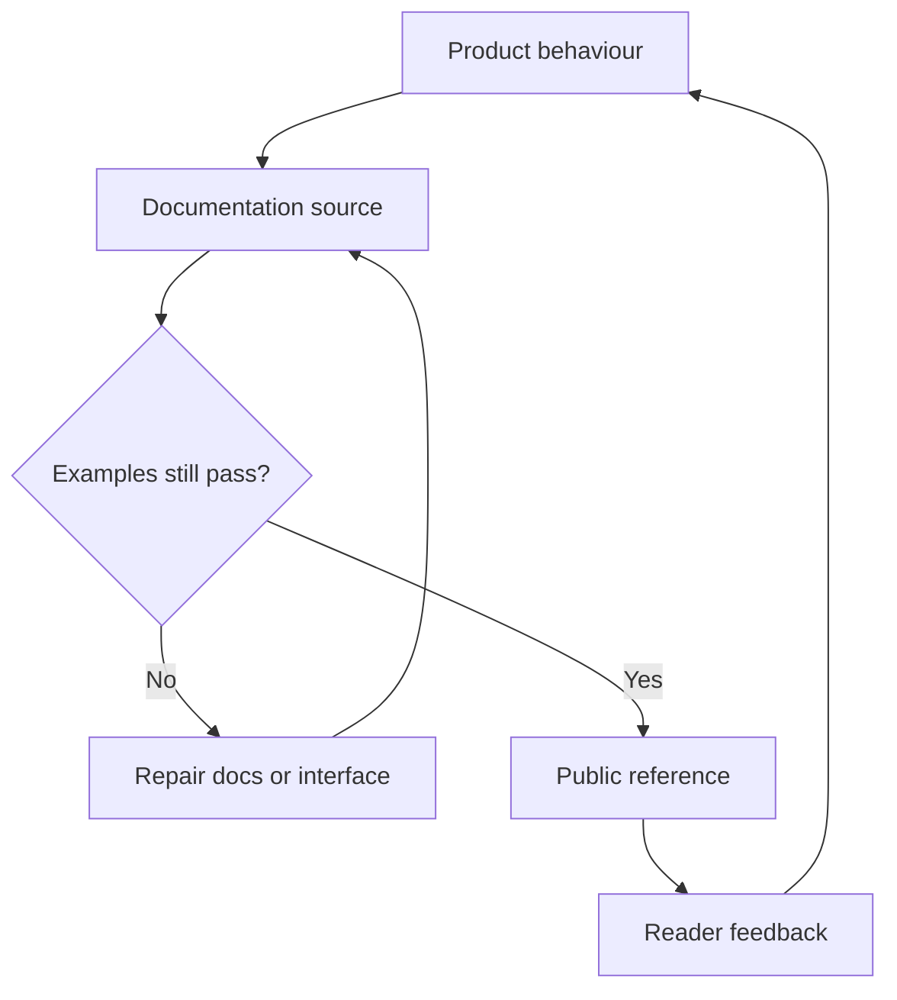

[← All work](https://github.com/J0UH) · [Product engineering](https://github.com/J0UH/product-engineering)

# Developer documentation and content systems

Documentation and content systems that help a developer get from a product idea to a working integration.

The documentation is often where someone discovers whether an API makes sense. A good example lets them move forward. A missing assumption can send both teams into a long support exchange.

This work connects the structure of the documentation to the product it describes. API versions, examples, migration notes, and visual assets need a clear place and a way to stay current.

## Keeping the example close to the interface

Parts of the documentation estate began with Mintlify and the Next.js Notion starter. The work around those foundations covers information architecture, product and API content, visual systems, and maintenance.

An example should be checked against the interface it documents. When a version changes, the reader needs to see what changed and how to migrate.

I also treat reusable public assets as maintained material. Their origin and licence matter, just as their consistency does. The aim is a documentation system that makes the next integration easier without requiring the person who wrote it to be in every conversation.

## Built on

Parts of the documentation estate began from the [Mintlify starter](https://github.com/mintlify/starter) and Travis Fischer's MIT-licensed [Next.js Notion starter](https://github.com/transitive-bullshit/nextjs-notion-starter-kit). The documentation work covers information architecture, product and API content, examples, the visual system, migration guidance, and maintenance.

## What the work covers

- API and integration documentation
- Documentation platform architecture
- Technical and product content workflows
- Reusable token and brand assets
- Versioned examples and migration guidance

A closer look at the technical flow

## Related work

- [Product engineering](https://github.com/J0UH/product-engineering)
- [Digital sales systems](https://github.com/J0UH/digital-sales-systems)
- [Developer platform and delivery](https://github.com/J0UH/developer-platform-delivery)

Working on a similar problem? [Tell me what you are building](mailto:ju@jomena.group?subject=Developer%20documentation%20and%20content%20systems).

*This is a public account of the work. Source code and private operating details are not included in this repository.*
