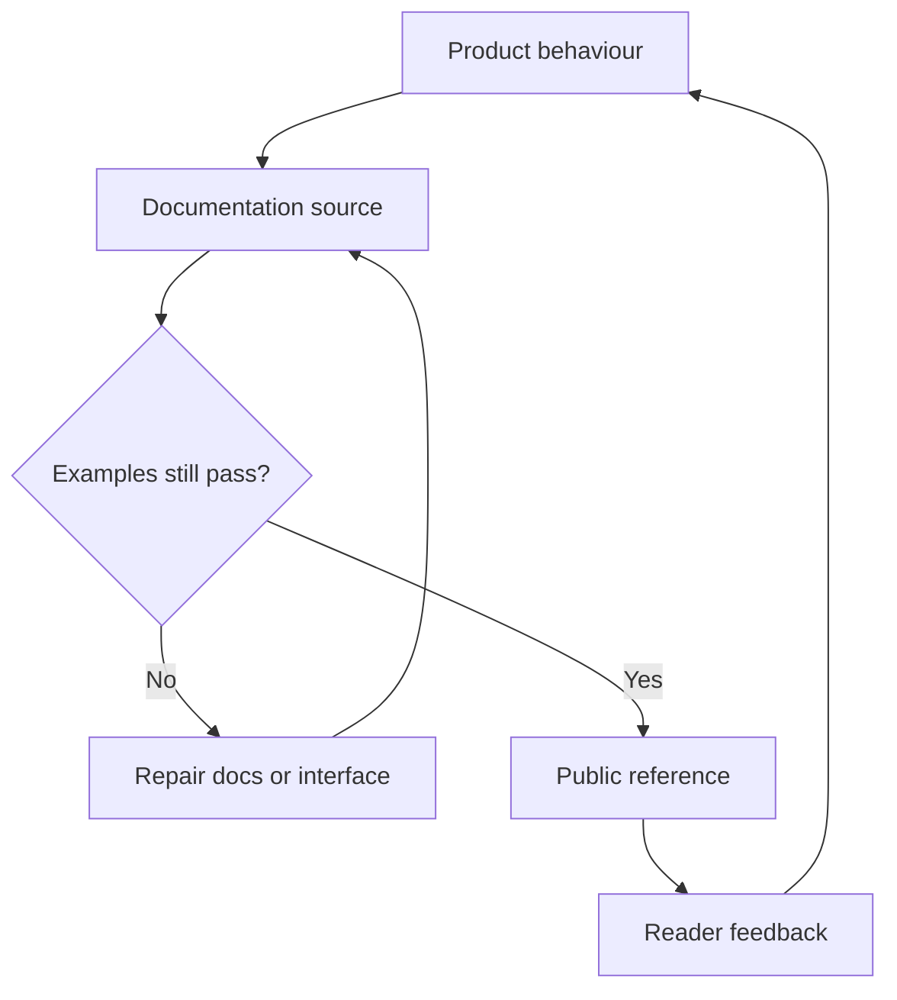

[← All systems](https://github.com/J0UH) · [Product engineering](https://github.com/J0UH/product-engineering)

  

# Developer documentation and content systems

Documentation is part of the interface. It is where an integration either becomes understandable or turns into support work for both teams.

## The engineering problem

Product behaviour, API versions, examples, brand content, and public assets change at different speeds. The content system had to keep those pieces navigable and close enough to engineering truth.

## Foundation and adaptation

Parts of the documentation estate began from the [Mintlify starter](https://github.com/mintlify/starter) and Travis Fischer's MIT-licensed [Next.js Notion starter](https://github.com/transitive-bullshit/nextjs-notion-starter-kit). The documentation work covers information architecture, product and API content, examples, the visual system, migration guidance, and maintenance.

## What the system covers

- API and integration documentation
- Documentation platform architecture
- Technical and product content workflows
- Reusable token and brand assets
- Versioned examples and migration guidance

## System shape

## Build notes

- Test examples against the interface they document.
- Give version changes a visible migration path.
- Keep reusable public assets licensed and traceable.

Public overview only. Source code, customer data, credentials, and private operating details are not included.

## Talk through a similar problem

Working on something similar? [Tell me about it](mailto:ju@jomena.group?subject=Developer%20documentation%20and%20content%20systems).
