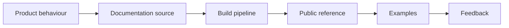

  

# Developer documentation and content systems

Documentation is part of the interface. It is where an integration either becomes understandable or turns into support work for both teams.

[Discuss a similar system](mailto:ju@jomena.group?subject=Discuss%20Developer%20documentation%20and%20content%20systems) | [Book a technical call](mailto:ju@jomena.group?subject=Book%20a%20technical%20call%20about%20Developer%20documentation%20and%20content%20systems)

## The engineering problem

Product behaviour, API versions, examples, brand content, and public assets change at different speeds. The content system had to keep those pieces navigable and close enough to engineering truth.

## What the system covers

- API and integration documentation
- Documentation platform architecture
- Technical and product content workflows
- Reusable token and brand assets
- Versioned examples and migration guidance

## System shape

## Build notes

- Test examples against the interface they document.
- Give version changes a visible migration path.
- Keep reusable public assets licensed and traceable.

Built under the Aryze umbrella. The underlying source and company IP remain private and owned by Aryze. Delivery involved people across engineering, product, operations, compliance, and design. Open-source foundations retain their original attribution and licences.

## Talk through a similar problem

If you are trying to build, untangle, or ship a system in this area, [send me a note](mailto:ju@jomena.group?subject=I%20need%20help%20with%20Developer%20documentation%20and%20content%20systems). If the problem needs a deeper technical conversation, [book a call by email](mailto:ju@jomena.group?subject=Book%20a%20technical%20call%20about%20Developer%20documentation%20and%20content%20systems).
